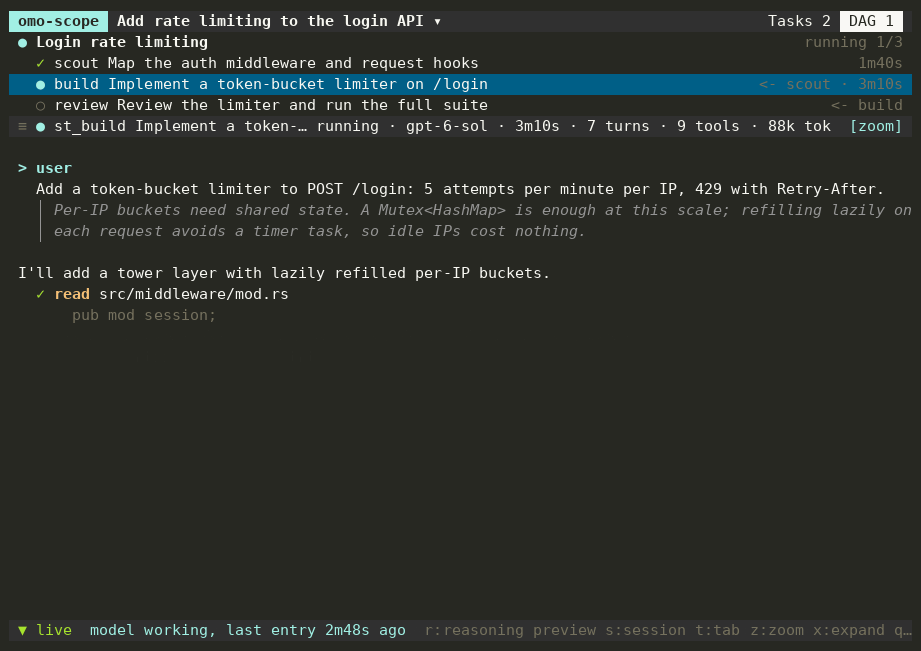

# omo-scope

View-only, mouse-driven TUI for OmO subagent tasks, DAG runs and live child transcripts.
It reads only files (`<project>/.omo/senpi-task/` and `~/.omo/agent/sessions/`); no OmO
extension, patch or transport is involved.



<sub>Recorded from a fabricated project with `demo/record.py` (real keystrokes and mouse events).</sub>

Install a prebuilt binary (Linux/macOS, x86_64/arm64; no Rust needed) into `~/.local/bin`:

```bash
curl -fsSL https://raw.githubusercontent.com/pawissanutt/omo-scope/main/install.sh | sh
```

`OMO_SCOPE_INSTALL_DIR` and `OMO_SCOPE_VERSION` (e.g. `v0.1.0`) override the defaults. From
source: `cargo install --path .`. Releases are built by pushing a `v*` tag.

```bash
omo-scope open        # inside Herdr: split the current pane, run the viewer beside it
omo-scope             # run in the current terminal
```

From an OmO prompt, `!omo-scope open` opens the viewer for the current session
(`$PI_SESSION_ID`). Running `open` again in the same pane reuses the existing viewer.

Mouse: click the session title to pick a session, click tabs, rows and log entries
(expand/collapse), wheel scrolls the pane under the pointer, click the `follow` pill to
resume auto-scroll. Keys: `s` sessions, `t` tasks/DAG, `z` zoom log, `x` expand all,
`f` follow, `Tab` focus, `j`/`k` move, `q` quit (closes the pane when started by `open`).

Live granularity is per transcript entry: OmO keeps token deltas in memory only, so text
appears when each message completes. The footer shows the running tool and its elapsed time.
While a `bash` call (or a `tool.bash` inside `eval`) runs, omo-scope tails the file the
command writes or reads: `>`/`>>`/`&>` and `tee` targets, or `*.log`/`*.out` paths, resolved
after a leading `cd`. Commands that only print to the terminal show output when they finish.
